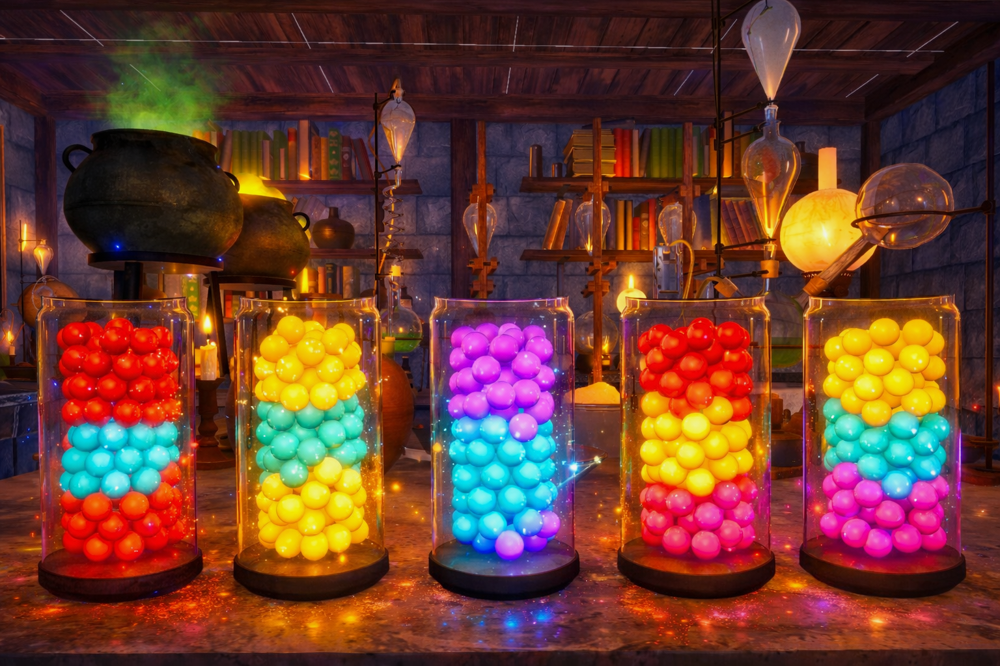

# The Alchemist



## Introduction

The Alchemist is a mixed-reality puzzle experience where players sort colored marbles by pouring them between jars placed in the real world. The experience combines virtual marble simulation in Unity with physical jar interaction, creating a hybrid system where the digital and tangible layers coexist.

The core interaction is inspired by the popular 2D liquid sorting mobile games, where players separate colored liquids into containers. In The Alchemist, this concept is translated into spatial XR interaction: instead of tapping containers on a screen, the user physically manipulates jars in the environment.

The project explores how tangible interaction combined with XR visualization can make sorting mechanics more intuitive, engaging, and spatially meaningful.

### Problem

Sorting puzzles on mobile devices rely heavily on abstract screen interactions. While these mechanics are effective, they do not leverage the spatial affordances of XR.

### Proposed Solution

The Alchemist transforms the classic liquid sorting mechanic into a mixed-reality experience where players:

* manipulate real jars tracked in XR
* pour virtual marbles between containers
* organize colors to maximize purity
* solve the puzzle before the timer expires

The system evaluates the resulting configuration using a scoring function based on sorting quality and marble placement.

### Gameplay Trailer

[Watch the Gameplay Trailer](https://drive.google.com/drive/u/0/folders/1g8HdCqaZkxnIR5-QMH2_2Dw0WWnHlmEM)


---

# Design Process

## Brainstorming

The project began with brainstorming around XR interactions that benefit from physical manipulation. The goal was to design an experience where the real world meaningfully participates in gameplay.

Early concepts included:

* spatial puzzle solving
* container manipulation
* sorting mechanics

The liquid sorting game genre was selected as inspiration because its mechanics translate naturally to pouring interactions between containers.

## User Journey

1. The player starts the experience and calibrates the room.
2. Virtual shelves and jars appear anchored in the environment.
3. The player grabs jars and pours virtual marbles between them.
4. The player attempts to group identical colors.
5. The score appears on a virtual scoreboard.

## Prototyping

Development progressed iteratively through the following milestones:

1. Colored marble spawning inside virtual jars.
2. XR grabbing interaction for the virtual jars.
3. Adoption of the Meta SDK to enable simultaneous hand/controller tracking.
4. Mapping between controller-tracked physical jars and virtual jars.
5. Room recalibration and anchor system for stable placement (physical table/ surface matching the virtual scene)
6. Marble teleportation and sorting mechanics using two interactable jars.
7. Timer and score evaluation.

Each iteration focused on improving reliability of spatial interaction and clarity of game feedback.

---

# System Description

## Features

### Tangible Jar Interaction

Players interact with real jars aligned with virtual counterparts. The XR system allows users to:

* grab jars
* move them in space
* physical table matching the virtual enviroment surface

The jars act as containers for simulated marbles.

### Marble Pouring Mechanic

Virtual marbles can move between jars, simulating a pouring interaction similar to liquid sorting puzzles.

Players must:

* group marbles of the same color
* avoid mixing colors
* maintain stable containers

### Jar Teleportation Mechanic

On a two finger pinch gesture, the jars contents are shuffled:

* rotate the jars contents (one handed pinch)
* Shuffle the jars contents (two handed pinch)
* visual effects are triggered

### Marble Tracking

Each jar uses a JarContentsTracker component that:

* tracks and retrieves all marbles currently inside the jar

This information is used for the marble teleporting and to evaluate sorting performance.

### Timer

A countdown timer limits the puzzle duration.

### Scoring System

The final score combines two metrics:

**Average Purity**

Purity measures the percentage of marbles belonging to the dominant color inside each jar.

**Marble Placement Ratio**

Ratio of marbles inside jars compared to marbles dropped on the floor.

**Final score:**

Final Score = Average Jar Purity × Marble Placement Ratio

This encourages both correct sorting and careful manipulation.

### Scoreboard

The result is displayed on a virtual scoreboard that provides:

* final score
* feedback on sorting quality

---

# Installation

## Requirements

| Component              | Version                |
| ---------------------- | ---------------------- |
| Unity                  | 6000.3.x    |
| XR Interaction Toolkit | Unity Package Manager  |
| 48 Particle Effect Pack            | Included package       |
| BK_AlchemistHouse            | Included package       |
| TextMeshPro            | Included package       |
| Device                 | Meta Quest 2 / Quest 3 |
| OVRCameraRig           | Meta XR Core SDK |


## Setup

Clone the repository:

```
git clone https://github.com/xZemond/TheAlchemist.git
```

Open the project in Unity:

```
Open Unity Hub
Add project folder
Open with Unity 2022.3+
```
---

# Usage

## Tangible Setup

Required physical setup:

* controllers attached to physical jars
* model of the virtual jars has to be adjusted accordingly
* use predifined positions for the physical jars.

The XR system aligns virtual objects with the physical containers so users can interact with them naturally.

## Starting the Experience

1. Open with Unity 2022.3
2. Run the Meta Quest Link via USB.
3. Precisely place the controller-tracked physical jars on predefined positions.
4. Launch the application via the Unity Play Button.

Virtual shelves and jars appear anchored in the environment.

## Controls

Players interact using hand gestures detected by the Meta XR SDK.

* Left hand two-finger pinch  
  Rotate the jar contents clockwise.

* Right hand two-finger pinch  
  Rotate the jar contents counter-clockwise.

* Two-hand pinch gesture  
  Randomly shuffle the jar contents.

* Physical jar movement  
  Moving the physical jars moves their virtual counterparts in XR.
## Gameplay Goal

Sort marbles so each jar contains mostly one color.

Players should:

* group identical colors
* reduce mixed containers
* avoid dropping marbles
* the experience ends, when the timer expires

---

# Contributors

Project developed as part of an course Design for Emerging Technologies (VT2026) at Stockholms Universitet.

Team Members:

* Saif Rahman
* Tobias Krämer 

---

# Repository

The repository contains:

* Unity project files
* scripts for XR interaction and scoring
* commit history documenting development progress

The project is intended to allow future students to reproduce, study, and extend the experience.

